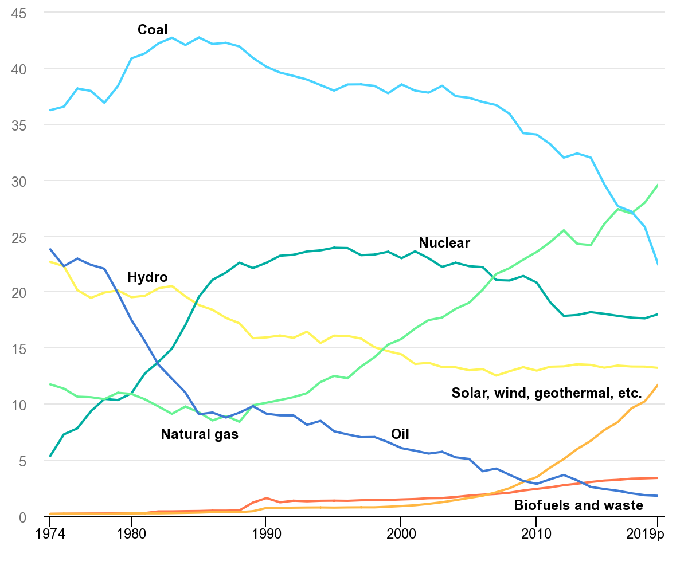
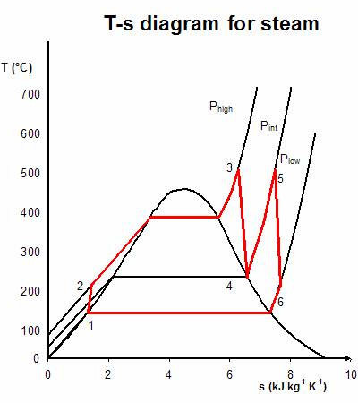

<!--
Editor Vincent Du
Creation Date: 26.08.2020
Last Update: 26.08.2020
-->


<!--
Markdown 常用语法
# Title
## subtitle 1
### subtitle 2
#### subtitle 3
etc.
--- *** ___分割线
*+- 无序列表
1. 2. 3.有序列表
> 引用的文字
空行 换行
*文字* 斜体
**文字** 粗体
\符号 符号 Latex
$$ 公式 $$
！[标题] (href) 图片
[标题] (href "title") 超链接,目录,文件

表格：
左对齐|居中|右对齐
:--|:--:|--:
2|3|5
10|100|1000

```编程语言（可选）
代码
```
`` 行内代码

~~删除线~~

Tasklist
- [ ] Eat
- [x] Code
  - [x] HTML


@import "xxx.md" 插入文档
-->


# Nuclear energy Episode 1 
# A very short introduction to nuclear reactors

## Content
1. [Scene one](#Scene-one)
2. [Scene two](#Scene-two)
3. [Scene three](#Scene-three)
4. [Scene four](#Scene-four)
5. [Scene five](#Scene-five)

## Scene one

Hi everyone. 
My name is doudou. 
I am a nuclear enginneer. 

## Scene two

Nuclear reaction is a fundenmental physical phenomenon born along with the universe. Heavy nucleus can split into two or more lighter ones. During this process a certain amount of energy is also released. On the other hand, nuclear fusion is a reaction in which, two or more light nuclei form into a heavier one releasing energy, like what's happening in the sun.   

When people talk about nuclear energy, there is always a bliss of anxiety going around: non human-readable equations, harmful radiations, atomic bombs, Chernobyl, Fukushima, or even big cooling towers releasing unharmful steam into the atmosphere. 

## Scene three

There seems to exist a thick layer of ice between most people and nuclear energy causing some misunderstandings. 
What is nuclear energy? how does a nuclear power plant work?
In this series of videos, I am gonna explained some facts about nuclear power plant, well, in a simple way. 

## Scene four


title: share-of-oecd-gross-electricity-production-by-source-1974-2019

source: IEA

(convert from a graph to a animation?)

Over the years the nuclear energy industries experience different situations in different countries. Like Germany, Swissland have decided to phase out nuclear power plants while countries like China, south Korea, England are still involved in building new reactors. 

## Scene five
What is a nuclear power plant?

## Scene six
No doubt that a nuclear power plant is a sophisticated system. 
It combines the efforts of hunderds of experts, physists & mechanical engineers & electrical engineers & chemists to run a single unit. 

## Scene seven
But put it in the easiest way, a nuclear power plant is like nothing but heating/boiling coolant medium in one or several closed systems. 

## Scene eight

Take light water reactor for example, the coolant, aka. water, absorbs heat from nuclear fuel and then releases it through driving a big turbine which is connected to the generator producing electricity. 

Except for the nuclear fuel part, the coal power plant works with the same mechanism. 
But nuclear power plant is just cleaner, in the sense of CO2 emission. 

## Scene nine

Since 1950s, various types of reactors have been built, deployed, demolished or designed.

Depending on the reaction type, there are fission reactors and fusion reactors.

If we try to group them by purposes, there are commercial reactors for electricity production, research reactors conducting different researches or producing isotopes for hospitals, propulsion reactors offering driving force for maschines like space ships and submarines. 

If we try to group them by the coolant medium, we will see light water, heavy water, gas, sodium, lead-bismuth, molten salt, etc.
You can find reactors which need moderator like water/graphite and reactors which don't.

Of course we can also distinguish them with respect to different fuel shape: cylindric pellet, plate, sphere or even in a fluid form flowing inside the circuit thus without any shape.

## Scene ten

Let's take a deeper look at one specific reactor type. Among all the current operating nuclear reactors the biggest share is the so-called pressurized water reactor, aka. PWR. Imagine the PWR as a simple 2-loop power transmission system, or some strange two-chain bicycle. You are playing as the nuclear fuel cycling the pedales. The first chain is driven by the first gear and going forwards. Then the second chain get the torque from the second gear and moves the wheel to rotate. Hmmm, there is something that I missed, the big cooling tower! Well it's more like a cooling system for the second chain since the wheel can only take around one third of the energy from the chain and the rest needs to be dumped somewhere to remain under working condition. 

Another question would be, what does pressurized mean? Well in the primary circuit of a PWR, or in the first chain, the coolant is heated up to 320 degree celsius and it must be pressurized to remain in liquid form. The primary loop pressure is normally around 160 bar or 160 times the atmospherical pressure, or the pressure at around 1600 m under the sea.

There is another type of light water reactor which is called Boiling water reactor, aka. BWR. One of the major difference to a PWR is that in a BWR the coolant is directly boiled by nuclear fuel to steam to drive the turbine, or only one chain bicycle. But don't get me wrong, the coolant in a BWR is also pressurized, only with a different magnitude, around 75 bar. 

## Scene eleven

As I mentioned before, the current efficiency of a PWR is around 33%, which means only around one third of the energy generated in the nuclear fuel is converted to electricity. Where does the other 66% go? You may already have the answer, yes, most of them will be emitted through the cooling tower, in forms of giant white water cloud.



Rankine cycle with reheat

source: https://en.wikipedia.org/wiki/Rankine_cycle

You might ask, why don't we utilize this 66% energy instead of dumping it into the atmosphere? Well, it is decided by the so-called rankine cycle, which is normally used to predict the performance of a steam-turbine system. Light water reactor, coal power plants are limited to this model. 

In order to increase the efficiency of the rankine cycle. One need to increase the pressure of the steam or the temperature of the steam (overheating) as much as possible. That's why light water reactor needs to be running with high temperature and high pressure.

## Scene twelve

That's all for the first introductory episode of nuclear reactors. It is intended to give a basic idea of how nuclear power plant run and how similar the nuclear power plant is to coal power plant. In the further episodes we will focus on the very unit which makes the nuclear power plants so unique, the nuclear reactor core.

## Scene thirteen

If you have more questions or suggestions, don't hesitate to leave a comment. And if you would like to learn more knowledge of a cool shining nuclear reactor, don't forget to subscribe. Thank you for watching.