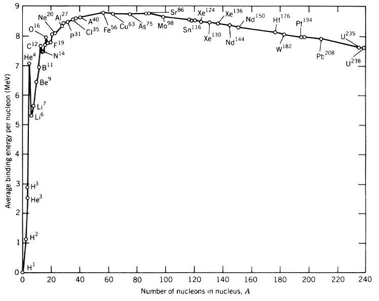
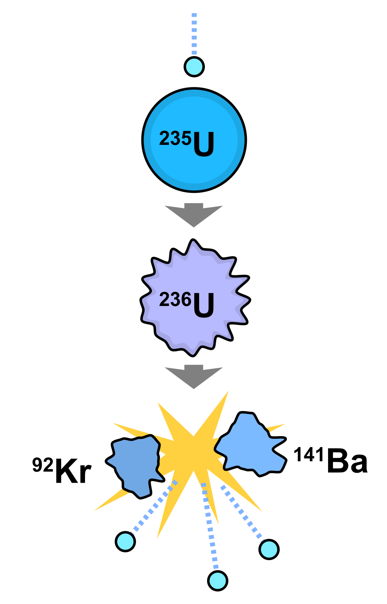

<!--
Editor Vincent Du
Creation Date: 26.08.2020
Last Update: 26.08.2020
-->


<!--
Markdown 常用语法
# Title
## subtitle 1
### subtitle 2
#### subtitle 3
etc.
--- *** ___分割线
*+- 无序列表
1. 2. 3.有序列表
> 引用的文字
空行 换行
*文字* 斜体
**文字** 粗体
\符号 符号 Latex
$$ 公式 $$
！[标题] (href) 图片
[标题] (href "title") 超链接,目录,文件

表格：
左对齐|居中|右对齐
2|3|5
:--|:--:|--:
2|3|5
10|100|1000

```编程语言（可选）
代码
```
`` 行内代码

~~删除线~~

Tasklist
- [ ] Eat
- [x] Code
  - [x] HTML


@import "xxx.md" 插入文档
-->


# Nuclear energy Episode 2
# A very short introduction to nuclear reactors

## Content
1. [Scene one](#Scene-one)


## Scene one

Hi everyone. 
My name is doudou. 
I am a nuclear enginneer. 

嗨，大家好，我的名字叫兜兜，我是个擅长哄睡的核能工程师。

## Scene two

上一期视频中我们笼统的介绍了一下核电站的工作原理并且展示了核电站和烧开水的相似性。在这一集中我们会初步了解一下反应堆里发生的事--为什么裂变是大自然的恩赐。

## Scene three

当这个男人在黑板上写下 $E=mc^2$ 的时候核能世界算是找到爸爸了。这大概是从我知道有钱到我知道我有多少钱一个完美的过渡。每一份在这个反应中释放的能量都能够被这个公式表达出来。说到核反应释放能量的原理之前我们不得不提一些基本粒子。

## Scene four

很多人都知道物质是由分子，原子组成。化学是来研究原子和原子之间的关系，化学反应中能量的释放与吸收也是靠着分子、原子间的重组来实现的。就像去吃火锅，可能把东西涮进锅里，虽然味道不一样，但是涮进去羊肉出来还是羊肉，土豆还是土豆（单押）。核能反应不一样，核能使用的是原子里更小粒子的能量。改变了原子核这个原子就变了，变成了另外一种物质，就像还是涮火锅，你涮进去个土豆，涮出来的是个羊肉，你说开不开心？

如果想深入了解一下到底如何通过涮火锅来释放能量的我们还要了解一下土豆羊肉更基本的组成物质。为了方便理解我们就把原子核细分为中子，质子两种物质。

把这两种粒子拉出单个的来质量分别是 $m_p$、$m_n$，但是如果这两个结合起来形成原子核神奇的事情就发生了，原子核的总质量并不等于质子质量以及中子质量总和并且是小于。在这里我们可能，好像，也许遇到了质量不守恒的情况。就像刘谦左手一个橘子右手一个橘子两个手一合就变成了一个半橘子似的。但是事实上这半个橘子没有消失，还记得之前的那个公式吗，是的，那个公式意思就是如果你有了质量，你就可以想办法转化成能量，这半个橘子就变成能量飞走啦。但是相反的，如果想要将质子中子从原子核里拆出来的话就需要往系统里注入能量补齐那半个橘子才行。

那如果刘谦左右手各两个橘子合在一起呢？最后是几个橘子？是三个吗？还真不一定。也就是说对于不同的原子将原子核里每一个橘子拆出来所需要的能量再平均到橘子数上是不一样的。

是的，你已经无限接近核能发热的真相了。无论是裂变还是聚变都是利用了这个橘子差。

## Scene five

而这个橘子差的学名叫做binding Energy。



这张图是根据核子数不同平均到每个核子上的binding Energy。简单理解一下就是如果将一个原子核完全拆成单个的质子和中子所需要注入到这个过程中的能量然后在平均到每个核子数上，或者，是将一堆核子融成一个原子核可以释放的能量再平均到每个核子数。

如果在这张图里从低处向高处移动就可以释放能量，反之则需要吸收能量。这张图也揭露了一个现象，那就是裂变需要较重的原子核，而聚变则需要较轻的原子核才能产能。


## Scene six

刚才那一段有点绕，下面我们还是用橘子来表示核子。

首先来简单复习一下核裂变的原理: 一个橘子轰击可裂变的具有235个橘子的原子核, 由于吸收了这个橘子，这个原子核拥有了236个橘子。由于这个原子核现在是一个很不稳定的状态，它会迅速分裂成两个大图橘子核，2-3个橘子，一些伽马橘还有上面我们说过的橘子变成的能量。这些新释放的橘子如果能遇到下一个可裂变的橘子核还是会有可能重复同样的裂变反应。这种现象我们把它叫做链式橘子反应。



在链式反应中如果说核燃料是木柴的话，那核橘子就是氧气，这两者缺一个火会灭。

其实无论核电站还是原子弹，他们的原理都是空闲橘子数控制。下一代的橘子数如果等于上一代的橘子数那就代表了可持续发展，如果下橘子数一直处于增长状态那就可能要boom boom boom了。

## Scene seven

那我们回到正题，为什么裂变反应是上天的恩赐呢？第一，通过橘子数量角度来讲，每次发生了裂变反应都会消耗一个橘子并且产出2-3个新鲜的橘子和能量，而新的橘子又可能引起新的裂变反应，如果能够保证下一代的橘子跟这一代的橘子数一样那我们就可以坐在这里坐享能量源源不断产出了是不是？核电站还真的就是这样子运行的，只不过由于可裂变的物质的量是一定的以及在整个过程中出现了很多别的吞橘子的怪兽，核电站需要每一段时间进行一次换料。但是换一次料便可以保证核电站运行1到1年半。第二，幸运的是在大自然中可裂变的物质并不少，并且还可以通过不可裂变的物质转化成可裂变的物质，我们似乎生活在一个不缺能源的世界，我们缺的仅仅是如何能将能量提炼出来的能力。

## Scene eight

好啦，这一期我们就介绍到这里啦。

在下一集中我们会介绍橘子如何在反应堆中掷骰子的。

## Scene nine

如果你有什么意见或者建议，请不要犹豫直接在下面留言。如果你想了解更多的闪闪发光的核电站请不要忘记订阅三联。谢谢大家观看。再见。