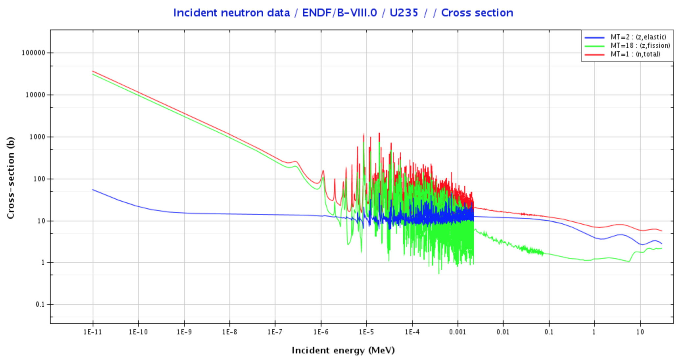

<!--
Editor Vincent Du
Creation Date: 26.08.2020
Last Update: 26.08.2020
-->


<!--
Markdown 常用语法
# Title
## subtitle 1
### subtitle 2
#### subtitle 3
etc.
--- *** ___分割线
*+- 无序列表
1. 2. 3.有序列表
> 引用的文字
空行 换行
*文字* 斜体
**文字** 粗体
\符号 符号 Latex
$$ 公式 $$
！[标题] (href) 图片
[标题] (href "title") 超链接,目录,文件

表格：
左对齐|居中|右对齐
2|3|5
:--|:--:|--:
2|3|5
10|100|1000

```编程语言（可选）
代码
```
`` 行内代码

~~删除线~~

Tasklist
- [ ] Eat
- [x] Code
  - [x] HTML


@import "xxx.md" 插入文档
-->

# Nuclear energy Episode 2
# A very short introduction to nuclear reactors

## Introduction

你想感受量子力学吗？你想感受量子力学吗？我是煲仔饭。

嗨大家好，我是doudou，大家最近的睡眠质量咋样儿了？

如果真的不太行的话要不试一试今天的玄学？

## Scene one

今天我们讲的是橘子王子去丛林摇骰子冒险的故事。

有一天橘子国王对王子说, 孩子你长大啦，应该自己出去见见市面了，父王没有什么可以送你，贴身送你两个守卫。你们每个人随身带着一个色子，如果在路上遇到了别的人，你可以掷色子来判断你和那个人的命运。来来来这个小手册给你，里面记录着每一种点数对应的命运，你可要记得这是我们橘子宇宙的法典，每颗橘子都要遵守。

说完，橘子国王就裂变了。

稍作整备，橘子王子便带着他的两个守卫出发。第一个他们遇到的是一个凶猛的怪兽，王子手下的一个守卫自告奋勇前去迎战。只见他快速的掷出筛子得到数字2，王子查看了手中的册子对着手下的士兵说，士兵，你会被怪兽吃掉！

这个士兵耸耸肩膀无奈放下武器，王子则和另外一个士兵趁着怪兽吃掉第一个士兵的时候悄悄的溜了。等走远了之后王子对着士兵说，天哪，好险，记得以后别摇2啊。

过了不久一个拿着球棒的运动员拦住了王子和士兵的去路。仅剩的士兵上前掷色子，他挠了挠脑袋抱起显示5的色子回头望向王子。王子打开他的手册大声的念到，哦天哪，你会被那个棒球棒击向另外一个方向。说完就见到运动员举起球棒全力将士兵打向了另外一个方向。

漫长的旅程只剩下了王子一个人默默前行。这时他遇到了一个美丽的公主，公主被她的爸妈逼婚，便问问王子的意思。王子说，且慢，我爸说了要我摇个骰先。王子左手摇晃色盅，右手举着国王送给他的书，口中念念有词，6啊6，我要6，公主这么漂亮，我就从了吧。

王子真的扔了个6，于是他和公主幸福的生活在了一起，直到他们裂变了，把他们祖传的小手册和骰子传给了他们的子女，继续谱写着下一段神奇的旅程。

## Scene two

是不是觉得遇见一个人就得掷色子，知识不决定命运，色子决定命运有点扯？我觉得也是哈，但是在微观世界里确实是这样。遇事不决量子力学，我啥也不是就是一团电子云。

在这个故事里对于橘子来说，基本的命运就是，被怪兽吃掉或者说是吸收，被球棒打跑，然后就是赢取白富美走向人生巅峰再裂变，当然，也有可能就是王子一路上谁也没遇到最后孤老终生。

如何定义核反应的概率呢？有人出了一个主意，定义一个面，每一种核反应都有自己的面，面大的概率就高，反之就小。就像，只要我脸长够大我就能跟安吉丽娜朱莉在一起一样。而这个面的学名叫做截面。

我们来具体看一张核反应脸大小的图。横轴呢从左到右表示橘子的速度，纵轴则表示脸的大小。红色的线所有脸大小的总和，绿色的表示迎娶白富美走向人生巅峰的脸，蓝色的则表示被运动员用棒球棒敲走的脸。

在左边的区域也就是橘子速度很慢的情况下，橘子更容易摇到6。中间的区域我们称为共振区域，在这里扔出6的概率不是很稳定。在橘子很快的区域呢，橘子更容易被运动员打跑。

这张图表达了什么人声哲理呢？做人不能太心急，除了心急吃不了热豆腐之外，心急还容易娶不了白富美。你看王子手底下的两个小兵一个被吃了一个被打跑了都是冲太快的原因。



在压水堆中，新出生的中子的能量集中在右边区域，如果想要中子更倾向于裂变的命运，那最好在他们遇到裂变物质之前的时候把他们的速度降到左边的区域。

## Scene three

在压水堆中，水不仅扮演着冷却剂的角色，同时也是中子的减速带。在中子和水中的氢原子核这两个粒子发生碰撞的时候就会有一部分动能从中子传递到氢原子从而减速。

碰撞又回根据动能是否守恒分为弹性碰撞和非弹性碰撞。在弹性碰撞中两个粒子的动能守恒，左边这张图就是弹性碰撞动能传递过去的情况。在非弹性碰撞中损失的动能会转换成类似于热，摩擦，声音的形式，右边这个图就是完美的非弹性碰撞的情况，两个物体完全粘合在了一起，在这个过程中动能的损失达到了最大，当然这个过程一般在两个物体质量差距较大的时候会发生。

由于中子和氢原子核的质量极为相近，我们近乎可以想像整个过程为弹性碰撞过程，就像是打台球一样。

所以退回到橘子宇宙的话，一个橘子王子从诞生到娶公主前总归是要经历几次运动员的毒打才行。

## Scene four

今天的故事就讲到这里啦。下一期我们将讲一下描述链式反应可持续性发展的重要指标Keff以及经典的6个参数公式。

## Scene five

如果你有什么意见或者建议，请不要犹豫直接在下面留言。如果你想了解更多的闪闪发光的核电站请不要忘记订阅三联。谢谢大家观看。再见。