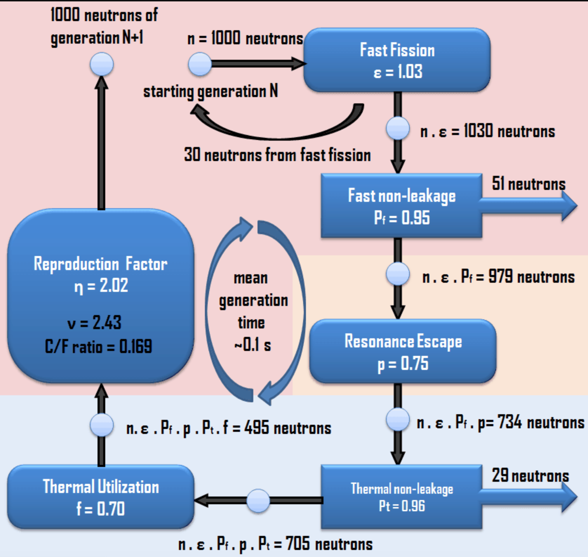
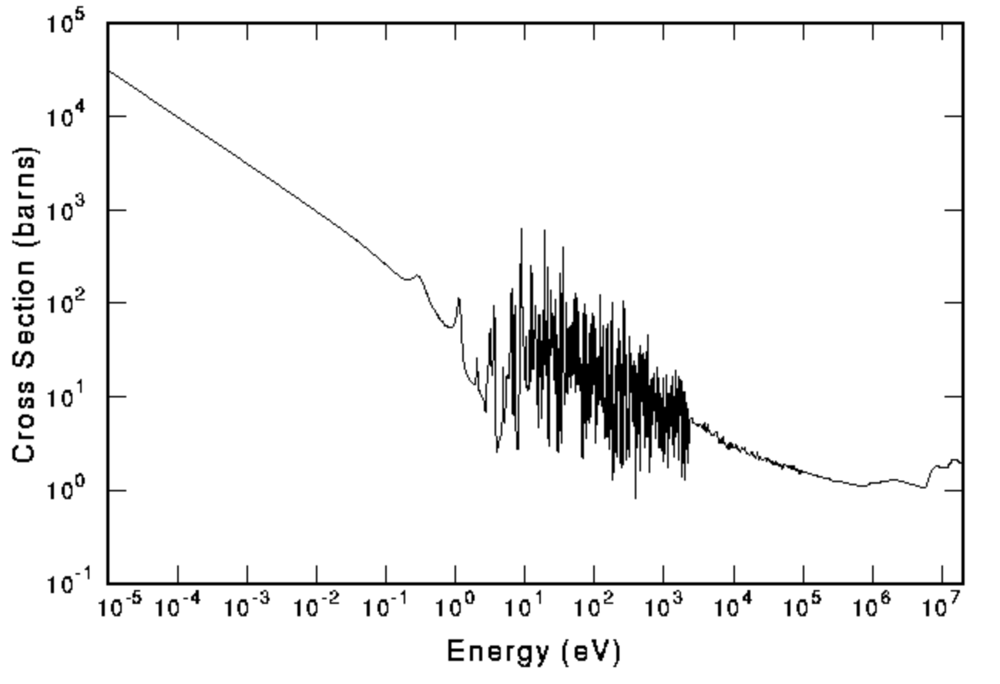
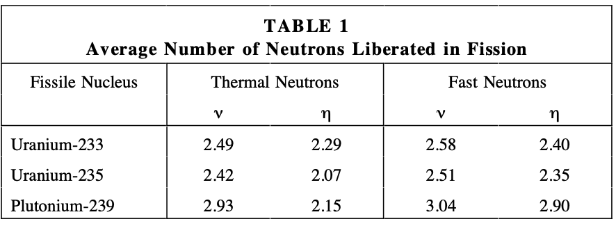
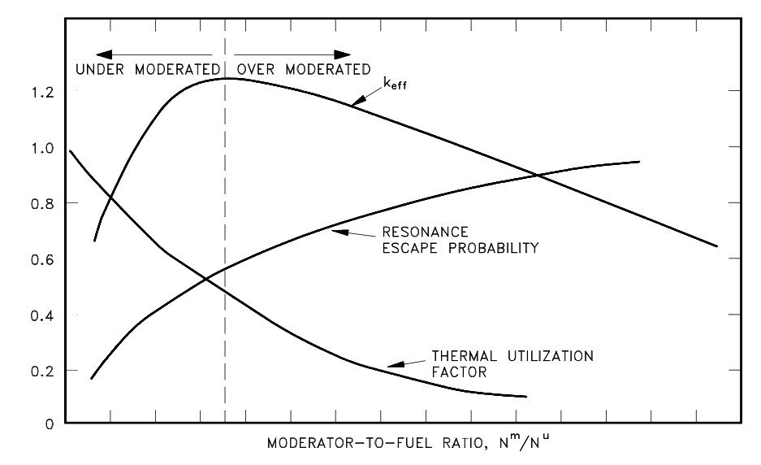

<!--
Editor Vincent Du
Creation Date: 26.08.2020
Last Update: 26.08.2020
-->


<!--
Markdown 常用语法
# Title
## subtitle 1
### subtitle 2
#### subtitle 3
etc.
--- *** ___分割线
*+- 无序列表
1. 2. 3.有序列表
> 引用的文字
空行 换行
*文字* 斜体
**文字** 粗体
\符号 符号 Latex
$$ 公式 $$
！[标题] (href) 图片
[标题] (href "title") 超链接,目录,文件

表格：
左对齐|居中|右对齐
2|3|5
:--|:--:|--:
2|3|5
10|100|1000

```编程语言（可选）
代码
```
`` 行内代码

~~删除线~~

Tasklist
- [ ] Eat
- [x] Code
  - [x] HTML


@import "xxx.md" 插入文档
-->

# Nuclear energy Episode 4
# A very short introduction to nuclear reactors

## Introduction

嗨大家好，我是doudou。已经又一年没有更新了吧。确实最近我个人发生了一些事情很难沉下心来做一件事情所以没更新。希望这一次能够梳理好自己，要不然童话故事没有结局主人翁得有多惨。

可能大家注意到了，我加了点儿背景音乐，应该，也许有助于大家快速入眠。毕竟，睡觉的时候人的脑子就像海绵，知识很容易就被吸收了，希望大家早点儿睡，睡得好！


## Scene one

今天我来给大家讲讲一个在反应堆物理中老生长谈的一个参数，Keff (effective multiplication factor)。理解这个概念很重要，因为只有满足Keff等于1，反应堆中的链式反应才能够有效进行下去。如果超过了1，中子就会在系统内无限复制导致系统失控。如果低于某个数值则系统内的中子数就会减少以至于链式反应无法保持。这个参数也会在以后的视频中经常被提到。

听起来挺复杂的昂，不过不要怕，有个大聪明用六个系数来计算这个参数。每个系数呢多多少少在1或者2附近，比起那些动不动就要微分再积分在微分再积分的diffusion或者transport方程要简单并且明了许多。

首先我们来看看等式的左边，$K_{eff}$，也被叫做有效增值因子，他表示下一代中子和上一代中子数量上的比值。比如一个家庭里如果爸爸和妈妈只生了一个孩子，那这个比值就是0.5，如果生了两个孩子那就是1。

$K_{eff} = \epsilon*P_{FNL}*p*P_{TNL}*f*\eta$

然而在等式的右边呢罗列着大大小小一共六个参数，乍一看有点复杂而且一个数都没有，还是挺难记的吧，既然Keff用来表示下一代中子数与上一代中子数的比值我们不妨顺着时间的纽带来看看一代中子的一生都会遇到那些分岔路。




首先遇到的第一个系数是$\epsilon$,它所表示的是除了热中子会引发链式反应外还有一小部分的中子来自于快中子引发的链式反应，这里这个系数大于1，一般大概在1.03左右。

第二个遇到的系数是$P_{FNL}$,他表示的是快中子刨除掉流失的  部分剩下的比例。

然后快中子遇到了慢化剂，比如说水，就像唐僧西天取经一样，中子漫化的过程会收到很多的危险还有诱惑，有一部分就被共振区间捕获掉了。这个共振区间逃逸的概率会被p来表示。



现在呢我们假设的中子已经经历了几次洗礼来到了热中子区间。首先就像快中子区域一样，热中子呢也有一部分会因为反应堆几何问题流失掉一部分，所以对应的系数就是$P_{TNL}$。

剩下的这部分中子呢则相当于留在系统中等待热能区的审判，这就牵扯到公式中剩下的两个因子，f和$\eta$。第一个因子f又被称为thermal utilization factor，它描述了在系统中被核燃料吸收的中子数和被所有材料吸收的中子数的比例。

现在呢就相当于唐玄奘西天取经九九八十一难还剩最后一难，因为前面5个因子中有四个小于一，整个系统没有办法保证中子数的稳定，所以整个链式反应的成败与否就靠最后一个因子了。而最后一个因子，他描述了裂变反应产生的中子数和在核燃料中吸收的中子数的比例。由于前几个因子的乘积要小于一，这个因子要远大于1才能够保证最后Keff等于一。从这张表中我们能够看出对于不同的中子能量不同的元素同位素这个$\eta$值是不一样的，如果是热中子区，U-233是非常好的可裂变元素，然而在自然界中U-233的含量太少了需要通过Th-232合成，而到了快中子区，Pu-239是很好的裂变材料。插一嘴，如果造原子弹的话你会选择哪种同位素呢？



可能细心的朋友发现了，既然这六个系数有四个都在1以下，而且我们一直在谈论热中子，如果是使用快中子的反应堆会怎样呢？这个朋友问题很好啊（我有一个朋友），必须要表扬一下。确实在快中子反应堆中这六项里有一些就是可以去掉了，比如$\epsilon$就会等于一，因为所有的裂变反应都是由快中子引发的。p这项就去掉了，因为中子不再被慢化，所以也不会被共振区吸收掉，进而$P_{TNL}$这一项也可以去掉了。既然这么多小于一的系数都去掉了，那快中子反应堆会更容易达到keff等于一吗？Wait，我们漏掉了f，在之前的图上我们能看到在快中子的情况下，中子截面的大小可是在数量级上远小于热中子的中子截面，这也让中子被燃料吸收变得更加困难。所以快中子堆一般需要更大的体积，更多的燃料才能够保持其反应性哦。



既然保持Keff等于一是反应堆可持续发电的前提条件之一，如何才能从设计上最大化这个值呢？有一个比例不得不提，那就是慢化剂和核燃料的比值。顾名思义，这个比值描述的是慢化剂和核燃料的数量比值，如果慢化剂变多，带来的效果就是会有更多的中子在接触到核燃料前被慢化到热中子区从而让更少的中子在共振区被核燃料捕获，但是另一方面，由于慢化剂增多，会有更多的中子被非核燃料的材料吸收从而降低了中子造成核裂变的可能性。所以如图所示，f和p在这个比例的影响下成反比关系，并且受他们影响，Keff在某处会有一个最大值。

在现在的反应堆设计中一般不会将反应堆设计的过饱和，因为在一些特定的情况下（比如说管道破裂，冷却剂不足）会产生反应堆临界甚至超临界的现象，这样反应堆的安全性没有办法满足。举个简单的例子就是切尔诺贝利，当然啦，要搞懂切尔诺贝利发生的事情可能还要补充几个更多的知识点，我们先埋个坑，慢慢来。
## Scene five

这一期先就这么多，我还是得适应适应做视频的节奏，希望在接下来我可以保持持续更新，我是你们的doudou，peace out。