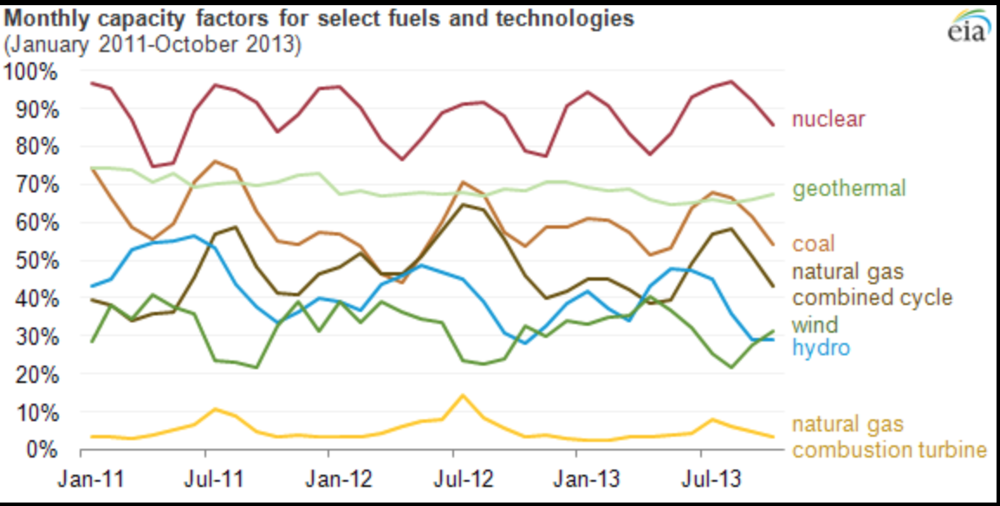

<!--
Editor Vincent Du
Creation Date: 26.08.2020
Last Update: 26.08.2020
-->


<!--
Markdown 常用语法
# Title
## subtitle 1
### subtitle 2
#### subtitle 3
etc.
--- *** ___分割线
*+- 无序列表
1. 2. 3.有序列表
> 引用的文字
空行 换行
*文字* 斜体
**文字** 粗体
\符号 符号 Latex
$$ 公式 $$
！[标题] (href) 图片
[标题] (href "title") 超链接,目录,文件

表格：
左对齐|居中|右对齐
2|3|5
:--|:--:|--:
2|3|5
10|100|1000

```编程语言（可选）
代码
```
`` 行内代码

~~删除线~~

Tasklist
- [ ] Eat
- [x] Code
  - [x] HTML


@import "xxx.md" 插入文档
-->

# Nuclear energy Episode 6
# A very short introduction to nuclear reactors

## Introduction

嗨大家好，我是doudou，我是一名核能工程师。上一集我挖了两个坑啊，一个是介绍关于反应堆的经济性，另外一个是关于中子毒剂的，我想后面那个就顺着一起说切尔诺贝利时说，所以这一集我们来看看核电站怎么赚钱的。

## Scene one

核电站怎么赚钱的？这不废话嘛，发电赚钱呗。这句话可谓是简明扼要，话粗理不粗。

扯一个其他的话题，不同的发电技术侧重点是不一样的，比如核电站火电站这种可以不间断持续性发电的电厂，大修检测除外一年中大概有7000以上的发电时常或者我们换个专业点的因子叫做容量因子（capacity factor），它形容的是电站每年发电量和每年理论最大发电量的比值，比值越高说明电站等效的满功率运行时间越长。想象一下你在房间里打着王者，突然间城市停电了，手机也没信号路由器也不好使，你的队友气的直跺脚在网络的另一端骂你猪。朋友们，上网的前提是有电啊。而另外一方面，发出来的电就是要实时用掉的，虽然会有不少冗余系统，就是那种几千瓦的大灯泡一排排的保证把用不掉的电消耗掉。所以别轻易就地球一小时啦，养成良好的用电习惯，要不然就有好多小灯泡亮起来了：）或者就买电动车吧，充进电池里也算是储能。

回到正题，由于核能火电的发电比较稳定，比较适合做为基本负载来源，我们只比较这两种电站。不同于火电，火电需要时时的送煤进系统里,有相当大一部分成本都在购买煤炭资源上。而核电站里一大部分成本在前期建设上，一次核燃料换料可以维持大概1年到1年半的发电，在运行时的核电的成本较小。

那为什么核电站可以一次换料维持这么久呢？我们从之前的章节里知道核电站的稳定运行的必要条件是反应性为0，再加上裂变反应会消耗可裂变的物质从而整个反应堆的反应性会渐渐降低，为了保持换了之后长时间的运行就需要在填料的时候要保证堆芯的反应性大于0，再通过增加硼酸浓度的方式将堆芯的反应性降为0。随着时间的推移，可裂变物质的减少，反应性下降，相应的硼酸的浓度也要减少，当硼酸浓度降为0时，反应堆就到了要换料的时间，当然，资本企业的目的就是多赚钱嘛，其实在当硼酸浓度降为0之后还是可以继续运行的，还记得我们上次讲的各种负反馈吗？对的，只要降低功率降低慢化剂的温度就可以提高反应性啦。

那有人就问了，往系统里多加点儿可裂变物质不就可以延长每次换料的周期啦？这句话确实也说到点子上了啊。没错儿多加点儿可裂变物质的比例会延长周期，但是另外一方面，包裹着核燃料的金属管会随着时间的推移衰减它的可靠性，没有人愿意看到任何的泄漏在核电站里发生，不光是安全的问题，同时也是因为钱：）出了事儿了就没法发电赚钱了：）Furthermore，如果单纯可裂变物质的比例就相应的要提高每次换料后初始的硼酸浓度，我们之前提到过如果硼酸浓度太高就会有可能造成慢化剂温度的反应性反馈系数为正值，这个从设计理念和安全理念上讲是要杜绝的。



下面这一点我其实觉得很有意思，但是演示之前我想先给大家再普及一个概念。Burnup，燃烧值，是用来描述核燃料在反应堆中的已使用情况，通俗点讲就是描述用这套核燃料或者单个核燃料组件发了多少电。当然啦，核燃料组件的燃烧值越高，可裂变物质就越少，它的反应性就越小，但是另一方面燃烧值越高说明这个核燃料组件的利用率越高。

如果一个核反应堆有160个燃料组件，大家想过一次换料需要换掉多少吗？是全部还是一半还是四分之一呢？让我们做个简单的数学题。

假设四节电池来发电，当所有的电池余量总量还剩200%的时候（相当于两节电池满电）电机停转，满功率的情况下每天会消耗总量一节电池的电量。

第一种情况每一次我们都用新的电池，从总量四节电池的电量到两节电池的电量一共使用2天并且替换下了四节剩余电量百分之五十的电池，或者等价于2节电池的满电量。

第二种情况我们使用四节剩余不同电量的电池，分别是100%，80%，60%，40%，四节电池在一开始的总剩余电量是280%。这一次消耗掉80%的电量相当于0.4天，四节电池的剩余电量分别为80%，60%，40%，20%。这时我们抛弃掉20%的电池并且安装一节新电池并重复之前的动作。重复了五个循环后我们发了同样两天的电并抛弃掉了5节剩余电量20%的电池，或者等价于1节电池的满电量。

由此可以看到每次只替换一部分的燃料组件有助于提高核燃料的利用率和电站的经济性。当然我们没有办法一味的降低每次替换的核燃料数来达到更高的燃烧值：第一因为这样会缩短每次燃料循环的周期，两个燃料循环中间还有检修和换料环节，这个环节是没有办法发电的哦。第二就像之前说的包裹核燃料的金属管的可靠性会随着燃烧值衰减。当然啦，材料学一直在探索可能的新型材料，那种在高燃烧值情况下还可以保证各项属性的材料。

有的时候限制我们的不是想象力，实在是材料不允许啊。发展材料学，四代反应堆核聚变不是梦。

## End
好啦，这一期就这么结束吧。今天的点挺多挺杂的，如果大家有什么想要了解的欢迎在下面留言。Stay safe and tuned。